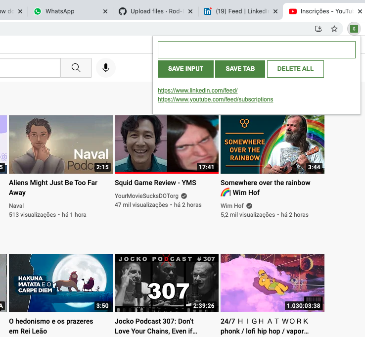

# Scrimba Frontend Career Path - (Leads Saver Chrome Extension - Module 03)

This is a solution to the [Scrimba Frontend Career Path - (Module/App name here)](https://scrimba.com/learn/frontend).

## Table of contents

- [Overview](#overview)
  - [The challenge](#the-challenge)
  - [Screenshot](#screenshot)
  - [Links](#links)
- [My process](#my-process)
  - [Built with](#built-with)
  - [What I learned](#what-i-learned)
  - [Continued development](#continued-development)
  - [Useful resources](#useful-resources)
- [Author](#author)
- [Acknowledgments](#acknowledgments)


## Overview

### The challenge

Users should be able to Code/Understand:

- const
- addEventListener()
- innerHTML
- input.value
- fucntion parameters
- template strings
- localStorage
- The JSON object
- objects in arrays

### Screenshot





### Links

- Solution URL: [Add solution URL here](https://your-solution-url.com)
- Live Site URL: [Add live site URL here](https://your-live-site-url.com)

## My process

### Built with

- Semantic HTML5 markup
- CSS custom properties
- JavaScript
- Chrome Dev tools


### What I learned
Making a chrome extension is much easier than it looks like.

To see how you can add code snippets, see below:

This is the only "hard coded" part of my html list of leads
```html
        <ul id="ul-el">
        </ul>
```
The list is rendered dynamicly, after being turned into a string. The string conversion happens for performance purposes, given that innerHTML is taxing. Changing the DOM is never free, and keeping performance costs to a minimum is always a good idea
```js
function render(leads) {
    let listItems = ""
    for (let i = 0; i < leads.length; i++) {
        listItems += `
            <li>
                <a target='_blank' href='${leads[i]}'>
                    ${leads[i]}
                </a>
            </li>
        `
    }
    ulEl.innerHTML = listItems
}
```
Grabbing the current tab on chrome is much easier than it looks. Interesting is that how it actually make sence to have a tab be checked at the same time for "active" and currentWindow status. Maybe you have two broswers open... you want to select the tab you are using, not the one on the background.
```js
tabBtn.addEventListener("click", function(){    
    chrome.tabs.query({active: true, currentWindow: true}, function(tabs){
        myLeads.push(tabs[0].url)
        localStorage.setItem("myLeads", JSON.stringify(myLeads) )
        render(myLeads)
    })
})
```

### Continued development

The course is getting more and more interesting. I'm very surprised how educational coding a chrome extension (witha real world use) can be.


### Useful resources

- [Example resource 1](https://www.example.com) - This helped me for XYZ reason. I really liked this pattern and will use it going forward.
- [Example resource 2](https://www.example.com) - This is an amazing article which helped me finally understand XYZ. I'd recommend it to anyone still learning this concept.

**Note: Delete this note and replace the list above with resources that helped you during the challenge. These could come in handy for anyone viewing your solution or for yourself when you look back on this project in the future.**

## Author

- Website - [Rodrigo Portfolio](https://www.gelatodigital.com)
- Frontend Mentor - [@Rod-Barbosa](https://www.frontendmentor.io/profile/Rod-Barbosa)
- Github - [@Rod-Barbosa](https://github.com/Rod-Barbosa)

## Acknowledgments

This is where you can give a hat tip to anyone who helped you out on this project. Perhaps you worked in a team or got some inspiration from someone else's solution. This is the perfect place to give them some credit.

**Note: Delete this note and edit this section's content as necessary. If you completed this challenge by yourself, feel free to delete this section entirely.**
